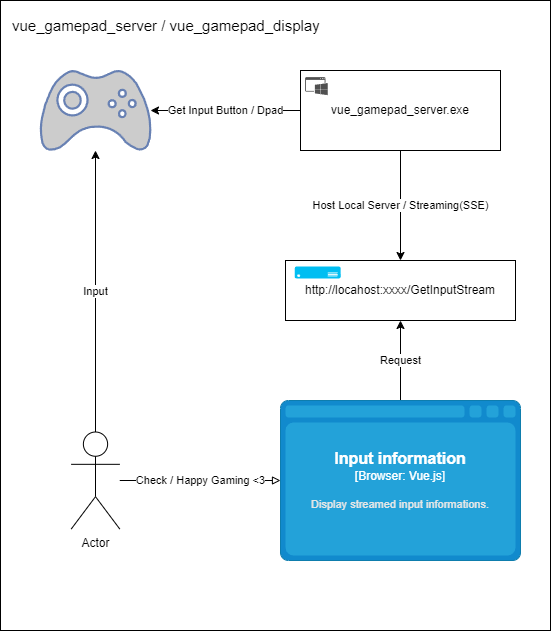

# システム構成

- 本リポジトリのサーバープログラムでゲームパッドの入力を取得する
- サーバーはエンドポイント`/GetInputStream`を公開し、ゲームパッドの入力情報を送信する
    - 送信フォーマットはServer Sent Event(SSE)とする
- 送信されたデータは`vue_gamepad_display`で表示する
    - https://github.com/ktakahiro150397/vue_gamepad_display
    - 対応するボタンのバインド・アイコンの設定は表示側で行う

# タスク

- [x] ゲームパッド入力の取得処理調査ごと
    - [x] サーバープログラムで直接Win32 APIを利用して取得できるかどうか？
        - できる。60Hz制限でポーリングし、キー入力に変更があれば送信する。
        - 方向キーを`dwPos`の角度から判定する。
        - ボタンは`dwButtons`のフラグで判定する。ボタンのインデックスはブラウザ側のGamepad APIと一致しているように見える。
    - [x] フロントで使用しているGamepad APIと同等の入力取得ができるかどうか？
        - 上記の通りで、多分大丈夫。
- [x] API動作確認ごと
    - [x] `TaskCompletionSource<T>`の動作確認
        - パッドボタン押下のイベントを受けとり、そのハンドラの中でデータを突っ込んで送信するイメージ？
        - https://medium.com/the-pragmatic-tech-review/asynchronous-programming-in-net-understanding-taskcompletionsource-599c6fe47537
        - これは不要でした。
- [ ] 送信スキーマ設計
    - フロントで必要な項目のみ含めて送信する
    - ボタン押下はGamepad APIの形式に変換して送信するとフロントで楽ちん
